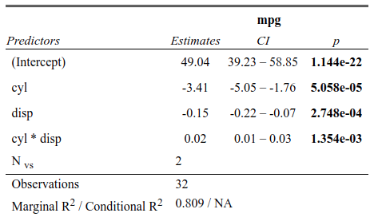
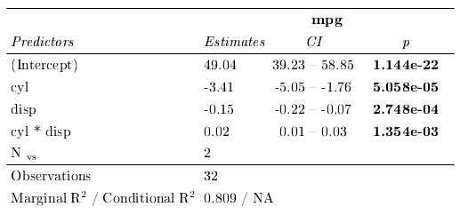

Convert `sjPlot::tab_model()` html tables to tex and pdf with
`html2pdf()` and use them in Rmarkdown documents with `tex2Rmd()`.

## Installation

html2latex is currently only available on Github.

``` r
# remotes::install_github("gorkang/html2latex")
library("html2latex")
```

## Requirements

Fully tested on Linux. Partially tested on Mac and Windows.

1)  You need a working [Libreoffice](https://www.libreoffice.org/)
    installation to convert `html` to `odt`  
2)  We include
    [Writer2latex](https://sourceforge.net/projects/writer2latex/files/writer2latex/)  
    in this package for the `odt` to `tex` step  
3)  You will need a working Java installation  
4)  You will also need a TeX compiler if you want to use the integrated
    pdf compilation (you can try installing `tinytex` and
    `tinytex::install_tinytex()`)

`html2pdf()` function uses a *Writer2latex* script which is sourced from
the extdata folder.

## Issues

If something does not work, make sure to have all the requirements
above. You can use `silent = FALSE` in `html2pdf()` to see in which step
things are failing. If nothing works, do send an issue including a
reproducible example.

## Example

Create a `sjPlot::tab_model()` and save it as html.

``` r
  library(html2latex)
  library(lme4)
  library(sjPlot)
  
  # This is a terrible model
  model = lmer(mpg ~ cyl * disp + (1|vs), mtcars)
  
  # We save the sjPlot table to an .html file
  
  TAB = sjPlot::tab_model(
    model,
    show.r2 = TRUE,
    show.icc = FALSE,
    show.re.var = FALSE,
    p.style = "scientific",
    emph.p = TRUE,
    file = "temp.html")
```



Using the `html2pdf()` we can transform the html output of
`sjPlot::tab_model()` to .tex. We can also compile to pdf in one step
with the parameter `build_pdf = TRUE`.

``` r
# Create tex and pdf

html2pdf(filename = "temp.html", 
  table_width = 13, 
   silent = FALSE, 
   style = TRUE, 
   build_pdf = TRUE, 
   clean = TRUE,
   name_table = "table1")

#> pdf file created in: /.../html2latex/temp.pdf
#> tex file created in: /.../html2latex/temp.tex
```



## tex2Rmd

You can include `sjPlot::tab_model()` html tables in a Rmarkdown
document that outputs as pdf in three steps:

### 1. YAML header

The YAML heather of the .Rmd document must include this:

    header-includes:
    - \usepackage{array}
    - \usepackage{longtable}
    - \newcommand\textstyleStrongEmphasis[1]{\textbf{#1}}
    - \makeatletter
    - \newcommand\arraybslash{\let\\\@arraycr}

------------------------------------------------------------------------

### 2. Extract the table bit from the tex file

The `tex2Rmd()` function creates a `.txt` file getting rid of the parts
of the `.tex` code that cause conflicts when rendering the Rmd document.

``` r
# Create table.txt to be able to use it in Rmd documents
tex2Rmd("temp.tex")

#> File with table code created in: table.txt
```

The tex file created with html2pdf can be rendered as a pdf by opening
the tex file in RStudio and using the `Compile PDF` button. But if you
want to use the table specific code inside a Rmd file (from
`\begin{longtable}` to `\end{longtable}`), we need to extract it first.
This is automatically done by the ´tex2Rmd()´ function.

### 3. Use this code in the Rmd document.

Finally, you need to insert the latex code below outside of a chunk in
your Rmd file.

    \newcommand{\myinput}[1]{%
      \begingroup%
      \renewcommand\normalsize{\small}% Specify your font modification
      \input{#1}%
      \endgroup%
    }
    \begin{centering}
    \myinput{table.txt}
    \end{centering}

------------------------------------------------------------------------

To see the result, please check the example.pdf in the github repository
(will not be installed alongside the package)

(You might need to then call pdflatex in a terminal separately, if
compiling via RStudio fails)

## Manually input latex code

Alternatively, you can manually insert the contents of table.txt in a
chunk staring with ```` ```{=latex} ````

See: <https://bookdown.org/yihui/rmarkdown-cookbook/raw-latex.html>
