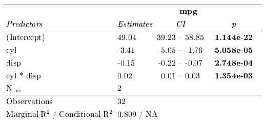

<!-- README.md is generated from README.Rmd. Please edit that file -->

# html2latex

<!-- badges: start -->

<!-- badges: end -->

Convert `sjPlot::tab_model()` html tables to tex and pdf.

## Installation

html2latex is currently only available on Github.

``` r
# remotes::install_github("gorkang/html2latex")
library("html2latex")
```

## Requirements

We use [Libreoffice](https://www.libreoffice.org/) to convert `html` to `odt` and [Writer2latex](https://sourceforge.net/projects/writer2latex/files/writer2latex/) for the `odt` to `tex` step. You will also need a TeX compiler if you want to use the integrated pdf compilation.

`html2pdf()` function uses a *Writer2latex* script which is sourced from the src folder.

## Example

Create a sjPlot::tab_model() and save it as html.

``` r
library(html2latex)
library(lme4)
#> Loading required package: Matrix
library(sjPlot)

# This is a terrible model
model = lmer(mpg ~ cyl * disp + (1|vs), mtcars)
#> Warning: Some predictor variables are on very different scales: consider
#> rescaling
#> boundary (singular) fit: see ?isSingular

# We save the sjPlot table to an .html file
sjPlot::tab_model(
  model,
  show.r2 = TRUE,
  show.icc = FALSE,
  show.re.var = FALSE,
  p.style = "scientific",
  emph.p = TRUE,
  file = "temp.html")
```

<table><thead><tr class="header"><th style="text-align: left;"></th><th style="text-align: center;"><p><strong>mpg</strong></p></th></tr></thead><tbody><tr class="odd"><td style="text-align: left;"><p>Predictors</p></td><td style="text-align: center;"><p>Estimates</p></td></tr><tr class="even"><td style="text-align: left;"><p>(Intercept)</p></td><td style="text-align: center;"><p>49.04</p></td></tr><tr class="odd"><td style="text-align: left;"><p>cyl</p></td><td style="text-align: center;"><p>\-3.41</p></td></tr><tr class="even"><td style="text-align: left;"><p>disp</p></td><td style="text-align: center;"><p>\-0.15</p></td></tr><tr class="odd"><td style="text-align: left;"><p>cyl \* disp</p></td><td style="text-align: center;"><p>0.02</p></td></tr><tr class="even"><td style="text-align: left;"><p>N vs</p></td><td style="text-align: center;"><p>2</p></td></tr><tr class="odd"><td style="text-align: left;"><p>Observations</p></td><td style="text-align: center;"><p>32</p></td></tr><tr class="even"><td style="text-align: left;"><p>Marginal R2 / Conditional R2</p></td><td style="text-align: center;"><p>0.809 / NA</p></td></tr></tbody></table>


Using the `html2pdf()` we can transform it to .tex. We can also compile to pdf in one step.

    # Create tex and pdf
    html2pdf(filename = "temp.html", table_width = 13, silent = TRUE, style = TRUE, build_pdf = TRUE, clean = TRUE)

If we create a pdf using `pdflatex` the end result looks like this:


